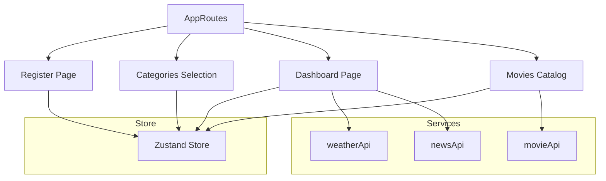

# The Super App

A premium, fully responsive React single-page application integrating registration, category interest selection, and a comprehensive widget dashboard featuring weather forecast, live self-rotating news feeds, persistent notepad, circular countdown timer, and movie recommendations catalog.

---

## 🚀 Live Repository Link
GitHub: [https://github.com/Aleenajomy/TheSuperApp.git](https://github.com/Aleenajomy/TheSuperApp.git).

Live Url:[https://thesuperapp.onrender.com](https://thesuperapp.onrender.com)

---

## 🎨 Design & Key Features

### 1. Split-Screen Registration
- **Banner Layout:** Displays an abstract banner image covering 100% height on desktop, and collapses gracefully on mobile devices to prevent form height compression.
- **Dynamic Validator:** Handles user details (Name, Username, Email, Phone number) with inline regex-based validation check alerts.

### 2. Category Selection Screen
- **Grid Layout:** Interactive 3x3 layout supporting 9 genres (Action, Drama, Romance, Thriller, Western, Horror, Fantasy, Music, Fiction) with clean visual styling.
- **Selection Constraints:** Enforces a minimum selection of 3 categories to unlock the dashboard. Emits real-time validation chip tags that can be dismissed on click.

### 3. Comprehensive Dashboard Widgets
- **User Profile Widget:** Displays user details, avatar, and tags of chosen category interests.
- **Live Weather Widget:** Fetches live weather (temperature, pressure, humidity, wind speed, atmospheric conditions) based on location utilizing OpenWeatherMap API, falling back to a structured mock view if no key is configured.
- **Self-Rotating News Feed:** A live news card fetching from NewsAPI, rotating through articles dynamically.
- **Notes Widget:** A fully persistent notepad syncing input state directly to local storage as you type. Includes an inline **Clear** button in the header to wipe your notes in one click.
- **Timer Widget:** Built with an animated SVG progress circle, Chevron time selector controls, and a synthesized audio alarm (via Web Audio API) which triggers a browser notification when reaching zero. Supports **Start**, **Pause**, **Resume** (with dynamic button labeling), and **Reset** functionality.

### 4. Movies Browse Page & Modals
- **Categorized Feed:** Fetches movies from the OMDB API categorized by selected genres.
- **Hover Transitions:** Implements smooth scaling hover effects.
- **Detailed Modal:** Clicking on any movie displays a detailed overlay containing plot, runtime, release year, actors, ratings, and genre tags. Includes an elegant placeholder fallback for missing/broken poster links.

---

## 🛠️ Technical Architecture



### State Management
- Engineered with **Zustand** for centralized and lightweight state management.
- User registration data, selected category chips, and note texts are stored and synchronized inside `localStorage` for complete session persistence.

### Styling & Responsiveness
- Styled entirely using **Vanilla CSS** with Google Fonts (`Outfit` and `Single Day`).
- Breakpoints configured at `1024px`, `768px`, `600px`, and `480px` to scale padding, gap margins, layout grids, and widget alignments cleanly.
- Implements mobile layouts where components stack vertically, and the timer inputs scale dynamically down to `320px` viewports without any clipping.

---

## 🔧 Installation & Setup

1. **Clone the repository:**
   ```bash
   git clone https://github.com/Aleenajomy/TheSuperApp.git
   cd TheSuperApp/Frontend
   ```

2. **Install dependencies:**
   ```bash
   npm install
   ```

3. **Configure Environment Variables:**
   Create a `.env` file in the `Frontend/` folder using the provided template:
   ```bash
   cp .env.example .env
   ```
   Open `.env` and fill in your actual API keys:
   ```env
   VITE_WEATHER_API_KEY=your_openweathermap_api_key
   VITE_NEWS_API_KEY=your_newsapi_key
   VITE_MOVIE_API_KEY=your_omdb_api_key
   ```

4. **Start the development server:**
   ```bash
   npm run dev
   ```

5. **Build for production:**
   ```bash
   npm run build
   ```
